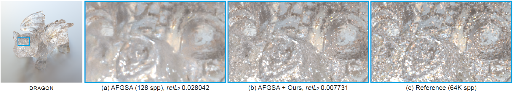

# [Self-Supervised Post-Correction for Monte Carlo Denoising](https://cglab.gist.ac.kr/sig22sspc/)

[Jonghee Back](https://cglab.gist.ac.kr/people/), [Binh-Son Hua](https://sonhua.github.io/), [Toshiya Hachisuka](https://cs.uwaterloo.ca/~thachisu/), [Bochang Moon](https://cglab.gist.ac.kr/people/bochang.html)



## Overview

This code is the official implementation of SIGGRAPH 2022 paper, [Self-Supervised Post-Correction for Monte Carlo Denoising](https://cglab.gist.ac.kr/sig22sspc/).
For more detailed information, please refer to our project page or other materials as below:

* [project page](https://cglab.gist.ac.kr/sig22sspc/)
* [paper](https://drive.google.com/file/d/1J5Ecc_wTBYL-G2qz8d4159Ic61pfOeHR/view?usp=sharing)
* [supplementary report](https://drive.google.com/file/d/1bqcaleTmoCAbH_mz12Qoga5o4Apicmq-/view?usp=sharing)
* [interactive viewer](https://cglab-gist.github.io/self-supervised-post-corr-supp/index.html)

We have tested the code on Ubuntu 20.04 with NVIDIA GeForce RTX 3090 graphics card, and we have additionally checked that this code works well on the following graphics cards: NVIDIA GeForce RTX 3060, TITAN RTX, Quadro RTX 8000.

## Requirements

We highly recommend running this code through [Docker](https://docs.docker.com/) and [Nvidia-docker](https://github.com/NVIDIA/nvidia-docker) on Ubuntu.
Please refer to the detailed instruction for the installation of [Docker](https://docs.docker.com/engine/install/ubuntu/) and [Nvidia-docker](https://docs.nvidia.com/datacenter/cloud-native/container-toolkit/install-guide.html#docker).


## Usage

### Building Docker image

Please use `run_docker.sh` to build a docker file with `Dockerfile` and run it.

### Running self-supervised post-correction

In order to run the provided post-correction codes, you can proceed in the following order:

1. Prepare image buffers in `data` folder.
2. Check configuration setting in `main.py`.
3. Run `main.py` with arguments regarding a test scene.

If you have modified CUDA code in `custom_op` folder, please build the op library using `build_custom_op.sh` to update `post_correction_lib.so` file.

### Example code

Please run this command for the provided example data as follows:
```
python main.py --scene dragon --spp 128 --deno afgsa
```

### Example data

The example data consists of input-denoised pairs with auxiliary features rendered by [PBRT-V3](https://www.pbrt.org/).
We provide four test scenes (bathroom, hair, dragon and sanmiguel) with three different Monte Carlo denoisers ([Kernel-Predicting Convolutional Networks for Denoising Monte Carlo Renderings (KPCN)](http://civc.ucsb.edu/graphics/Papers/SIGGRAPH2017_KPCN/), [Adversarial Monte Carlo Denoising with Conditioned Auxiliary Feature Modulation (AMCD)](http://adversarial.mcdenoising.org/) and [Monte Carlo Denoising via Auxiliary Feature Guided Self-Attention (AFGSA)](https://aatr0x13.github.io/AFGSA.github.io/afgsa.html)).
The example data can be available here:

* [Example data (bathroom)](https://drive.google.com/file/d/1ZeiVeug5bqbzFHWiLSBQEFgW_YycunJG/view?usp=sharing)
* [Example data (hair)](https://drive.google.com/file/d/1SxJ_prxEHKmD7-M3l7hjQBo89VCRvvAZ/view?usp=sharing)
* [Example data (dragon)](https://drive.google.com/file/d/1QwAx_79UOHLE6FxTmgBIaU7VK84UL_fg/view?usp=sharing)
* [Example data (sanmiguel)](https://drive.google.com/file/d/1IPrY1X8pg8b2m66iwIMjxPHLI6ol0mCk/view?usp=sharing)

After downloading and unziping the data, please place it in `data` folder.

## License

All source codes are released under a [BSD License](license).


## Citation

```
@inproceedings{Back22,
author = {Back, Jonghee and Hua, Binh-Son and Hachisuka, Toshiya and Moon, Bochang},
title = {Self-Supervised Post-Correction for Monte Carlo Denoising},
year = {2022},
isbn = {9781450393379},
publisher = {Association for Computing Machinery},
address = {New York, NY, USA},
url = {https://doi.org/10.1145/3528233.3530730},
doi = {10.1145/3528233.3530730},
booktitle = {ACM SIGGRAPH 2022 Conference Proceedings},
articleno = {18},
numpages = {8},
keywords = {self-supervised denoising, self-supervised learning, self-supervised loss, Monte Carlo denoising},
location = {Vancouver, BC, Canada},
series = {SIGGRAPH '22}
}
```

## Contact

If there are any questions, issues or comments, please feel free to send an e-mail to [jongheeback@gm.gist.ac.kr](mailto:jongheeback@gm.gist.ac.kr).

## Credits

We have used EXR I/O functionalities (`exr.py` in `codes/image_io`) from [Kernel-Predicting Convolutional Networks for Denoising Monte Carlo Renderings (KPCN)](http://civc.ucsb.edu/graphics/Papers/SIGGRAPH2017_KPCN/) project.